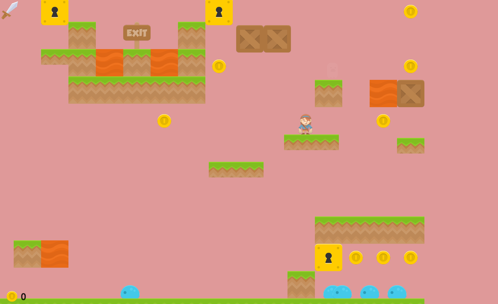

# ARCADE PLATFORMER
## Gaëlle Viso et Paul Pizzetta

Bienvenue à notre jeu platformer ! 

Arcade Platformer est un jeu de plateforme en 2D réalisé avec la bibliothèque Python Arcade. Le joueur incarne une héroïne qui doit traverser des niveaux remplis d’obstacles, d’ennemis, de platformes mouvantes et d'interrupteurs qui permettent d'ouvrir des portes.

### Lancer le jeu

1. Clonez le repo sur votre machine.
2. Dans le terminal, taper 
> $ uv run main.py  

pour notre sélection de niveaux, ou alors
> $ uv run main.py chemin_du_niveau

pour choisir le niveau que vous voulez.  

**Les niveaux disponibles sont :**

- maps/big_boss.txt
- maps/chasse_pieces.txt
- maps/enigme.txt
- maps/invasion.txt

- maps/level_1.txt
- maps/level_3.txt
- maps/level_4.txt
- maps/moving_map4.txt

Merci à **Alexandre Rossetti** pour les quatre premiers niveaux !

### Description des extensions

*Pour ceux qui savent créer des map :*

1. Frog, à placer avec "f" sur le sol 
> Enemi qui se déplace comme un blob, mais qui saute parfois.
2. Ghost, à placer aveg "g" sur le sol
> Enemi qui se déplace comme un blob, qui devient transparent.
3. Boss, à placer avec "B", pas forcément sur le sol, avec une config comme un interrupteur.
> Ennemi avec ses propres attaques aléatoires. Il n'est pas affecté par les murs, possède plusieurs vies, et peut ouvrir des portes à sa mort.

### Arc
L'arc a un délai avant d'être chargé, et tire une flèche quand le click gauche est relâché. Ce n'est pas exactement ce que les consignes demandaient pour le fonctionnement de l'arc, mais la modification à été accepté par le Dr. Sébastien Doeraene.

### Bug Arcade
En testant notre projet, nous avons trouvé un bug : 

Quand la joueuse se trouve sur une platforme mobile, nous avons découvert que la faire bouger très légèrement, de telle sorte à ce qu'elle finisse sur la limite entre deux blocs, cause un effet de glissement, probablement vers le centre du bloc le plus proche.

Nous avons réussi à reproduire ce bug sur 5 ou 6 projets d'autre groupes, c'est pour ça que nous pensons que c'est un bug de la bibliothèque Arcade.

Pour corroboration, voir le README.md de Luca Dalmas et Benoît Jungo ou ce [post sur ED](https://edstem.org/eu/courses/2070/discussion/186051)