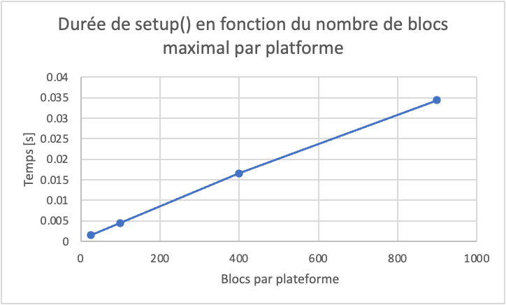

# Liste de Modules et leurs Classes 

## Central
| Module        | Classes | Description                  |
|---------------|-------------------------------|------------------------------|
| `main.py`         | -        | Lancement du programme             |
| `gameview.py`     | `GameView`      | Classe principale du jeu        |
## Ennemis

| Module        | Classes | Description                  |
|---------------|-------------------------------|------------------------------|
| `monster.py`  | `Monster`                     | Classe abstraite de base des ennemis. Elle étend arcade.Sprite |
| `bat.py`      | `Bat`                         | Monstre qui vole aléatoirement, dans un rayon d'action. N'est pas affecté par les murs.                             |
| `blob.py`     | `Blob`                        | Monstre qui bouge sur le sol, faisant des aller-retours.                             |
| `frog.py`     | `Frog`                        | Monstre qui bouge comme un blob, mais qui saute verticalement parfois, aléatoirement.                          |
| `ghost.py`    | `Ghost`                       | Monstre qui bouge comme un blob, mais qui n'est pas affecté par les murs. Il devient peu à peu transparent, jusqu'à qu'il soit presque invisible.            |
| `boss.py`     | `Boss` `Attack`      |  Monstre spécial, ayant ses propres attaques, définies dans l'enum `Attack`. Il choisit ses attaques aléatoirement, sauf dans certaines situations spécifiques. Il étend aussi la classe `Lever`. Il peut alors ouvrir des portes, à sa mort. Il est doté de plusieurs vies.   |

```
Monster
├── Blob
│    ├── Frog
│    └── Ghost
├── Bat
└── Boss → Lever
```

## Armes

| Module           | Classes | Description                  |
|------------------|---------------------------------|------------------------------|
| `weapon.py`      | `Weapon`                       | Classe abstraite de base des armes. Elle étend arcade.Sprite. |
| `bow.py`         | `Bow`                         | Classe représentant l'arc     |
| `sword.py`       | `Sword`                       | Classe représentant l'épée  |
| `arrow.py`       | `Arrow`                       | Classe représentant les flèches tirées par l'arc |
| `weapon_type.py` | `WeaponType` | Enum des types d'armes : Bow et Sword, pour l'instant. Pour référencer une arme sans en créer une instance.  |

```
Weapon
├── Bow
└── Sword

Arrow
WeaponType
````

## Joueur

| Module           | Classes | Description                  |
|------------------|---------------------------------|------------------------------|
| `player.py`      | `Player`                       | Classe représentant le joueur. Elle étend arcade.Sprite. |

## Map

| Module                   | Classes    | Description                  |
|--------------------------|-------------------------------|------------------------------|
| `platforms.py`           | `Platform`, `Direction(Enum)`   | `Platform` représente une ensemble de blocs qui bougent ensemble. Ici, les blocs sont représentés par leur position initiale, par leur type. `Direction` représente les directions dans lesquelles peut bouger un platforme, VERTICAL ou HORIZONTAL. |
| `platform_arrows.py`     | `PlatformArrows`| Une classe étendant `Enum`, permettant de transformer une flèche en caractère spécial, par exemple "←", en type de donné facilement manipulable par le code. |
| `non_platform_moving_blocks.py` | `NonPlatformMovingBlocks` | Cette classe représente un bloc en mouvement, d'un type dont le mouvement n'est pas géré directement par Arcade, tel que la lave, ou les interrupteurs. |
| `lever.py`               | `Lever`                     | Classe représentant un interrupteur, qui peut agir sur des `Door` |
| `door.py`                | `Door`                      | Classe représentant une porte, qui peut-être être ouverte ou fermée.   |
| `map.py`          | `Map` | Classe gérant la création des cartes. |
| `map_mouvement.py`| `MapMovement` | Classe gérant le mouvement des platformes dans la carte.  |
| `lever_doors_logic.py`   | `LeverDoorsLogic`          | Classe gérant l'association entre les `Lever` et les `Door`, à la création de la carte.  |

## Utilitaires

*Ces modules sont importées presque partout, elles sont faites pour ça. Ce sont des modules qui nous 
permettent de simplifier les calculs, de centraliser les constantes, et d'éviter la duplication de code pour des outils qui sont utilisés dans plusieurs classes
différentes.*

| Module            | Classes | Description                  |
|-------------------|----------------------------|------------------------------|
| `constants.py`    | -                  | Contient toutes les constantes du projet. Permet à celles-ci d'être facilement accessibles. |
| `helper.py`       | `Disk`, fonctions utilitaires | `Disk` permet de créer le rayon d'action de la chauve-souris et du boss. |
| `math_personal.py`| -               | Fonctions mathématiques simples mais non-présentes directement dans le module `math`. |
| `custom_exception.py` | `CustomException` | Type d'Exception lancé par notre code, afin de s'assure que le message d'erreur à destination de l'utilisateur soit lisible. Tout autre type d'exception imprime simplement "An unknow error has occured".

# Intéraction des classes entre elles


La classe principale du projet est la classe `GameView.` Celle-ci importe les 
classes principales des autres sous-groupes de classes, telles que `Monster` 
ou `Weapon`. Cependant, elle n'importe pas les classes comme `Blob` ou 
`Sword`, qui étendent ces classes principales, grâce au polymorphisme. En effet, `GameView` travaille essentiellement 
sur des listes — plus précisément des SpriteList — contenant des `Monster`. 
Grâce au polymorphisme de ces classes abstraites, il n'est pas nécessaire 
de différencier les types de `Monster` pour les faire se déplacer, attaquer ou mourir.  

  
Une partie importante du travail de `GameView` consiste à créer une instance de la 
classe `Map`. Celle-ci importe tous les différents types de Sprites, notamment les 
sous-classes de `Monster`, et lit le fichier de carte que le joueur a sélectionné. 
Pour cela, elle remplit les listes de `Monster`, `Lava`, etc., que `GameView` lui 
a fournies, avec les sprites correspondants, en se basant sur le fichier texte fourni.  

En plus des sprites `Monster` et des blocs immobiles, la carte est aussi constituée 
de plateformes mobiles, ainsi que d'interrupteurs. Afin de produire une carte complète 
comprenant ces éléments, la classe `Map` se sert des classes `MapMovement` 
(qui permet de gérer les blocs mobiles) et `LeverDoorsLogic` (qui s'occupe des liens 
entre les `Lever` et les `Door`). 

Un autre groupe de classes sont celles qui étendent `Monster`, comme mentionné 
précédemment. `Monster` est une classe abstraite définissant les méthodes publiques move() 
et die(). Pour satisfaire au principe de polymorphisme nécessaire dans `GameView`, ainsi qu'à 
l'encapsulation, les sous-classes de `Monster` ne définissent aucune méthode publique 
supplémentaire. Ainsi, une fois la carte créée, il n'est jamais nécessaire de connaître 
le type exact de `Monster` pour le faire évoluer. Une particularité est qu'une de ses 
sous-classes, `Boss`, étend également Lever en plus d’étendre `Monster`. Ici, le LSP est respecté.
En effet, toute sous classe de `Monster` peut-être remplacée là où un un `Monster` est attendu.

Nous avons aussi l’ensemble des classes relatives aux armes. `Weapon`, une classe 
abstraite, suit les mêmes principes que `Monster` avec ses sous-classes. Ainsi, 
`Weapon` et ses sous-classes gèrent elles-mêmes leurs collisions, leurs déplacements, etc. 
Pour cette raison, `Weapon` importe la classe `Lever`. Liées logiquement à Weapon, 
nous avons les classes `Arrow` et `WeaponType`. La première est simplement le sprite lancé 
par un `Bow`. Elle est séparée de la classe `Bow`, car une fois lancée, le mouvement de 
l’arc n’a plus aucun impact sur celui de la flèche. 
La seconde classe, `WeaponType`, est une énumération des types d’armes, 
permettant de représenter le type d'arme accessible au joueur sans en instancier une.  

`Player` est la classe représentant notre joueuse. Elle gère le mouvement, 
le score (les pièces ramassées), ainsi que l’arme sélectionnée, 
qui est différente de l’arme active. En effet, il y a toujours 
une arme sélectionnée, mais pas nécessairement une arme équipée. 

Enfin, la dernière classe importante est la classe `UI`. 
Une instance de `UI` est créée dans `GameView` et s’occupe de toute l’interface 
graphique annexe du jeu. Par exemple, elle affiche la vie restante du boss, 
s’il y en a un. En revanche, l’affichage principal, tel que celui de la 
joueuse, est géré directement dans `GameView`.

Nous avons aussi plusieurs autres classes utilitaires et 
énumérations, que vous pouvez retrouver dans les tableaux ci-dessus 
mais dont l’utilité ne sera pas détaillée ici.

# Méthodes intéressantes

La méthode create_weapon() de `WeaponType` est un exemple du principe encapsulation. 
En effet, cette méthode crée directement un `Weapon` du type voulu, sans que `GameView` ou 
`Player` ait besoin de connaître le type de l'arme. Il y a même une encapsulation double, si l'on prend en compte la 
méthode du même nom appartenant à `Player`. Grâce à cette méthode, et donc au principe d'encapsulation, 
`GameView`, qui appelle Player().create_weapon() n'a même pas besoin de savoir que la classe `WeaponType` existe, 
alors que c'est elle qui fait le travail derrière l'appel de la fonction.
Pour prouver que `WeaponType` n'existe pas au yeux de `GameView`, il suffit de remarquer que `GameView` n'importe pas la classe `WeaponType`. 
Ainsi, pour `GameView`, toute la classe `WeaponType` est relégué au status de détail d'implémentation.

Nous avons beaucoup utilisé les propriétés dans ce projet, en conjonction avec les méthodes et les attributs privés, 
afin de protéger nos classes d'interférences externes. Un exemple est dans `Platform`, où nous avons l'attribut privé
__direction, ainsi qu'un getter et un setter publiques pour cet attribut, afin de pouvoir lire et écrire l'attribut sans casser 
la logique de __direction, qui est que chaque platforme ne peut bouger que dans une direction. Ainsi, dans le setter de direction,
nous nous assurons que self.__horizontal_movement soit None, avant d'autorister l'attribut à être mis-à-jour en Direction.VERTICAL.

La méthode __partition_file() de `Map` utilise les expressions régulières, afin de permettre à notre code de lire une map créée 
aussi bien sur Mac, Linux et Windows.

# Analyse de complexité

## Setup()
Analyse de complexité du setup d'une platforme, avec paramètre n où n est le nombre de blocs constituant une plateforme, plus le nombre de flèches qui l'affectent.
Voici les fonctions qui gèrent l'initialisation des plateformes, pour référence.

```python
def find_platforms_in_map_matrix(self, map_matrix : list[list[str]]) -> None :

        visited : set[tuple[int, int]] = set()     # θ(1)

        for line in range(len(map_matrix)) :   
            for column in range(len(map_matrix[line])): 
                if map_matrix[line][column] in self.__platform_characters and (line, column) not in visited :      # θ(1)
                    platform = Platform()      # θ(1)
                    self.__grouping_platform(map_matrix, line, column, platform, visited, None) # θ(f)
                    if platform.moves : # θ(1)
                        self.__list_of_platforms.append(platform)   # θ(1)
```

```python
def __grouping_platform(self, map_matrix : list[list[str]], line : int, column : int, platform : Platform, visited : set[tuple[int, int]], valid_arrow : PlatformArrows | None) -> None :

        if line < 0 or column < 0 or line >= len(map_matrix) or column >= len(map_matrix[0]) or (line, column) in visited : 
            return  # θ(1)
        if map_matrix[line][column] not in self.__platform_characters | {a.value for a in PlatformArrows} :
            return  # θ(1)

        if (value := map_matrix[line][column]) in {a.value for a in PlatformArrows} :
            arrow_type = PlatformArrows.get_arrow_enum(value)   # θ(1)
            if arrow_type == valid_arrow :  # θ(1)
                visited.add((line, column)) # add dans un set est θ(1)
                arrows_counted = arrow_type.count_arrows(line, column, 1, visited, map_matrix)  # θ(1)
                platform.add_arrow_info(arrow_type, arrows_counted) # θ(1)
            else :
                return  # θ(1)
        else :
            visited.add((line, column)) # add dans un set est θ(1)
            if map_matrix[line][column] in self.__platform_characters : # θ(1)
                arcade_line = matrix_line_num_to_arcade(line, len(map_matrix))  # θ(1)
                platform.add_sprite((arcade_line, column))  # θ(1)

            for d_line, d_col, direction_arrow in [(0, -1, PlatformArrows.LEFT), (0, 1, PlatformArrows.RIGHT), (1, 0, PlatformArrows.DOWN), (-1, 0, PlatformArrows.UP)] :
                self.__grouping_platform(map_matrix, line + d_line, column + d_col, platform, visited, direction_arrow)
```

La fonction `find_platforms_in_map_matrix()` a pour but d’explorer la matrice représentant notre carte, d’identifier les groupes de cases correspondant à des plateformes mobiles, puis de les regrouper à l’aide de la fonction récursive `grouping_platform()`. Pour faire cela, elle parcourt chaque case de la matrice et, si la case contient un caractère de plateforme et n’a pas encore été visitée, elle initialise une nouvelle instance de plateforme et appelle `grouping_platform()` pour regrouper toutes les cases adjacentes formant cette plateforme.

Dans notre analyse de complexité, nous allons nous intéresser uniquement à la complexité de créer une seule plateforme, et non à toutes les plateforme de carte. Alors, nous allons commencer par remarquer la ligne de code suivante, dans `find_platforms_in_map_matrix()` :

```python 
if map_matrix[line][column] in self.__platform_characters and (line, column) not in visited : 
```

Cette condition, associée au code dans `grouping_platform()` qui ajoute une case au set `visited` s'il fait partie de la plateforme que l'on est en train d'explorer, assure que la fonction `find_platforms_in_map_matrix()` n'explore jamais deux fois la même case. Ainsi, pour notre analyse de complexité, comme nous nous concentrons uniquement sur une plateformes, il suffit d'analyser la fonction récursive `grouping_platform()`.

La fonction `grouping_platform()` visite récursivement les cases voisines tant qu’elles sont valides (c’est-à-dire qu’elles sont dans la matrice, non encore visitées, et qu’elles contiennent un caractère de plateforme ou une flèche). Elle ajoute chaque case visitée et valide à un ensemble visited, ce qui garantit qu’aucune case n’est explorée plus d’une fois, si l'on considère qu'explorer une case signifie passer les deux premières conditions de la fonction de `grouping_platform()`, qui sont en θ(1). 

Même si chaque appel récursif peut théoriquement générer jusqu’à quatre appels supplémentaires (vers les quatre directions cardinales), le mécanisme de marquage dans visited empêche toute redondance. Le nombre total d'appels récursifs est donc en θ(n), puisque chaque case valide est explorée une seule fois, et que les cases sont valides ne sont jamais explorées.

### Benchmarking 

| N | Durée de setup() [s] | 
|:---------:|:---------:|
| 25 | 0.00154 |
| 100 | 0.00454 | 
| 400 | 0.0166| 
| 900 | 0.0344|



Grâce au graphique, fait à partir de mesures réelles de temps, nous pouvons vérifier notre analyse de complexité. 
En effet, nous voyons une droite, ce que corrobore notre analyse de complexité en θ(n).   
Nous n'avons pas pu prendre de mesures au-delà de n ≈ 900, à cause de la limite de récursion de python.

## On_update()

Analyse de complexité du update des flèches tirées par l'arc, avec paramètre n où n est le nombre de flèches dans le jeu.
Voici les fonctions qui gèrent la mise à jour des flèches, pour référence.


```python
def __arrow_collisions(self) -> None :

        for arrow in list(self.__arrow_list) : # θ(n)

for arrow in list(self.__arrow_list) : #on repete n donc θ(n)

            for lever in arcade.check_for_collision_with_list(arrow, self.__lever_list):# on repete c fois (c=cst) donc θ(n)
                if not lever.broken:
                    lever.on_action() # θ(1)
                    self.solid_block_update() # θ(1)
                    arcade.play_sound(arcade.load_sound(":resources:sounds/rockHit2.wav")) 
                    arrow.remove_from_sprite_lists() # θ(1) (par l'implémentation d'arcade)
                break

                

            for monster in arcade.check_for_collision_with_list(arrow, self.__monster_list) :
                self.__on_monster_death(monster) # θ(1)
                arrow.remove_from_sprite_lists() # θ(1)
                break

            for _ in arcade.check_for_collision_with_lists(arrow, (self.__solid_block_list, self.__list_of_sprites_in_platforms, self.__lava_list)): # θ(1)
                arcade.play_sound(arcade.load_sound(":resources:sounds/rockHit2.wav"))
                arrow.remove_from_sprite_lists() # θ(1)
                break

```

```python
    def do_on_update(self, delta_time: float) -> None :
        
        # autre code, non pertinent 

        for arrow in self.__arrow_list : # θ(n)
            arrow.move() # θ(1), voir plus bas
            if (arrow.center_y < self.__camera.bottom_left.y): # θ(1)
                arrow.remove_from_sprite_lists() # θ(1)
```

```python
    def move(self) -> None :
        """Defines the movement of an arrow."""
        
        self.change_y -= constants.ARROW_GRAVITY # θ(1)
        self.center_x += self.change_x # θ(1)
        self.center_y += self.change_y # θ(1)
        self.angle = atan2_deg(self.change_x,self.change_y) - 45 # θ(1)
```
La première chose que nous devons remarquer, en analysant la complexité, est la complexité de la fonction `remove_from_sprite_lists()`, une fonction d'Arcade. Cette fonction s'exécute en θ(1)l où le nombre d'opérations constances est faible, car les sprites ne sont pas enlevées de chaque liste individuellement, mais directement du physics engine. Une fois que l'on sait ça, nous pouvons voir que les seules opérations qui ne s'effectuent pas en θ(1) sont les boucles sur les flèches, qui sont en θ(n). Comme il y a deux telles boucles, mais qu'elles ne sont pas imbriquées, nous trouvons que le total est du update est en θ(n).

Ici, nous pouvons en profiter pour mettre en évidence l'avantage d'avoir utilisé une fonction de la bibliothèque externe Arcade, plutôt que d'avoir essayé de récrire la fonction par nous-mêmes. En effet, si nous avions dû enlever chaque flèche de chaque SpriteList par nous-mêmes, comme il peut y avoir un très grand nombre de SpriteList dans le jeu, cela aurait pu affecter les performances du jeu. Cela n'aurait pas affecté la complexité algorithmique, car le nombre de SpriteList est constant ici, mais nous savons que dans un problème pratique, la seule complexité théorique ne suffit pas à évaluer les performances d'un programme.

### Benchmarking

resultat des test:
number	cumtime	 	
10	    0.0422 
100	    0.565
500	    0.984
1000    1.95
2000	3.91
5000	9.73
10000	19.3 
20000	38.4
50000	104
